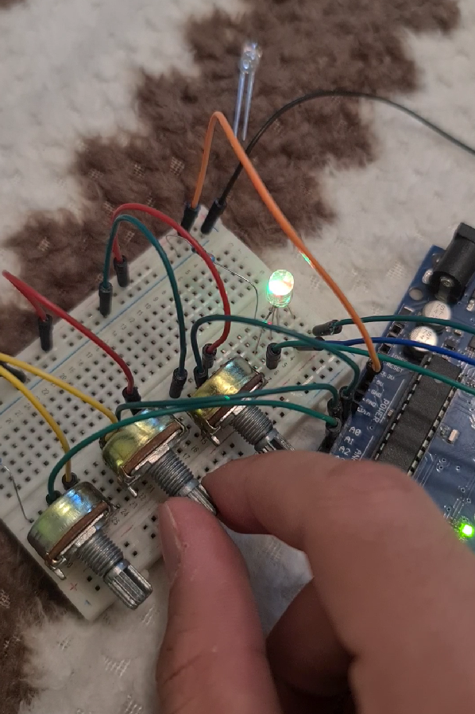

# Introduction to Robotics 2021-2022 course
Personal repo with homeworks for the Robotics Course

Professor: Andrei Dumitriu   

#  Homework 1 - Light up an RGB led

## Components 
* RGB led
* potentiometers
* rezistors and wires 

## Task requirement 
Control each of the color of the RGD led using potentiometers. Control is done using digital electronics (values of the potentiometers are read by Arduino and map the values to each of the pins connected to the leds)

## Setup 

## Demo
(See drive)[https://drive.google.com/drive/folders/105TRyTHTtz6iL83V6PBk72QXlePSrPj8?usp=sharing]
